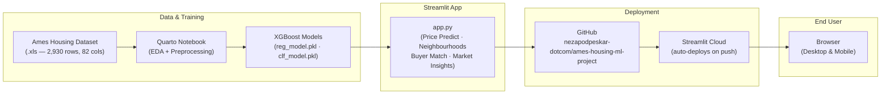

# Ames Housing — End-to-End ML Project
**Author:** Neža Podpeskar

## Live App
[Open the Prediction App](https://ames-housing-by-nezky.streamlit.app)

## Architecture

## What this project is
A complete machine learning study on the Ames Housing dataset (2,927 residential property sales in Ames, Iowa, 2006-2010), answering two questions:
- Regression: What will this home sell for? (predicts SalePrice)
- Classification: Is this a premium home? (top 25% by price)

## How to run the analysis report
1. Clone this repository
2. Install dependencies: pip install -r requirements.txt
3. Register the kernel: python -m ipykernel install --user --name ames-venv
4. Render: cd notebooks && quarto render 01_eda_and_preprocessing.qmd
5. Open notebooks/01_eda_and_preprocessing.html in your browser

## How to run the app locally
pip install -r requirements.txt
streamlit run app.py

## Key findings
- XGBoost regression: Test R2 = 0.944, MAE = $12,353
- XGBoost classification: Test Accuracy = 96.1%, ROC-AUC = 0.9912
- No data leakage: all preprocessing fit inside a Pipeline on training data only